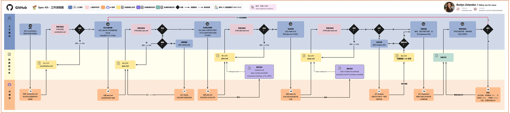
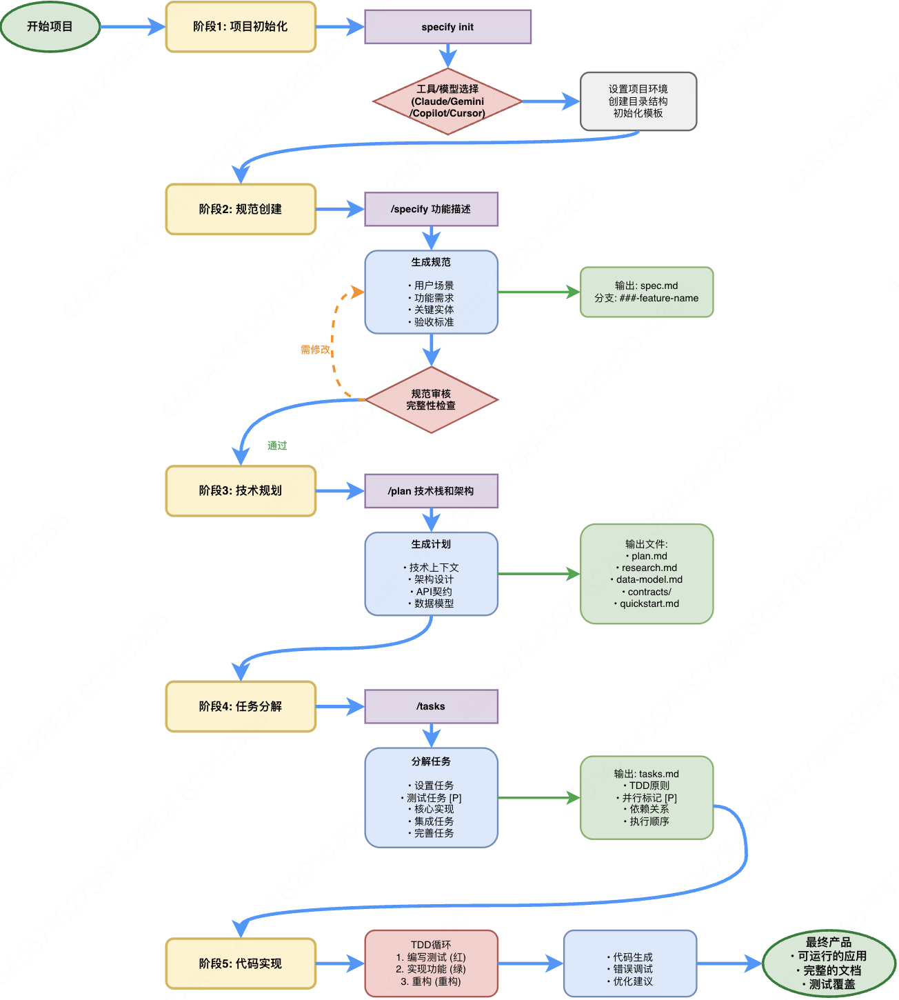
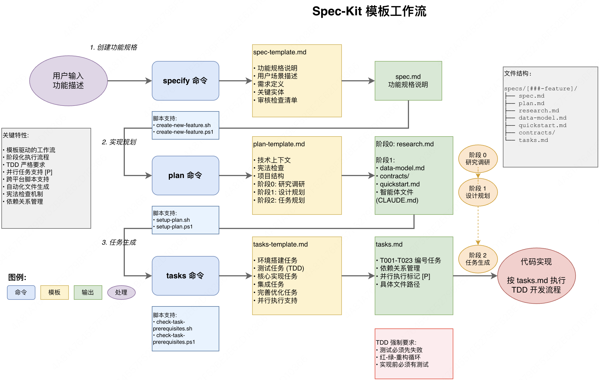

# Spec Coding 实践指南

## 什么是 Spec Coding

Spec Coding 是一种**规范驱动开发**（Spec-Driven Development，SDD）的 AI Coding 开发范式。核心思路是将模糊需求的 prompt 转换为具体的标准规范文档（如技术方案 `design.md`、任务清单 `tasks.md`）来引导 AI 进行开发，本质上是**上下文构建**。

简单来说：先想清楚"做什么"，再让 AI 来"怎么做"。

## Spec Coding vs Vibe Coding

| 维度 | Vibe Coding | Spec Coding |
|---|---|---|
| 开发模式 | 跟着感觉走，探索式发现，"干中学"（偏直觉判断），快速迭代、创意驱动，先做出来 | 工程化管理，"计划后执行"（逻辑分析、系统性规划），复杂系统需要明确架构，避免技术债务累积 |
| 交付效率 | **短期**：极高的初始开发速度，快速启动。<br>**长期**：可能因重构和返工导致总体时间增加，"永远在调试"的体验感 | **短期**：前期规划阶段耗时较长，延迟启动。<br>**长期**：减少返工，总体项目时间更短，但要注意避免过度设计 |
| 质量保障 | 依赖开发者的即时判断和反复调试 | 通过文档审查、规范检查、测试优先等机制保障质量 |
| 可维护性 | 代码规范、代码注释、单元测试等 | 文档化、版本控制、代码审查等 |
| 适用场景 | 原型验证、快速 MVP、探索性项目、个人小工具 | 中大型项目、团队协作、需要长期维护的生产系统 |

> 💡 **实践建议**：两者并非对立，而是互补。推荐先用 Vibe Coding 快速验证想法，验证通过后再用 Spec Coding 将其工程化。对于复杂项目，Spec Coding 能显著减少后期维护成本。

## Spec Kit

- **链接**：[github/spec-kit](https://github.com/github/spec-kit)
- **定位**：由 GitHub 官方开源的 Spec Coding 工具包，通过结构化的 slash 命令引导 AI 完成从需求到代码的全流程。

### 核心工作流

```
/specify
    ↓
/clarify（可选）
    ↓
/plan
    ↓
/checklist（可选）
    ↓
/tasks
    ↓
/implement
```

各阶段说明：

1. **`/specify`** — 想法到 PRD 的转化。通过与 AI 的迭代对话，将模糊的想法转化为全面、结构化的 PRD。AI 提问、识别边缘情况、定义验收标准。重点强调"用户需要什么"和"为什么需要"，避免过早关注"如何实现"。
2. **`/clarify`**（可选）— 针对模糊需求提问澄清，降低理解偏差风险。
3. **`/plan`** — PRD 到实现计划的转化。将业务需求映射到技术方案，产出技术架构、数据模型、API 接口规范、测试用例等（`plan.md`、`data-model.md`、`contracts.md` 等）。
4. **`/checklist`**（可选）— 检查需求完整性和跨文档一致性。
5. **`/tasks`** — 实现计划到可执行任务的转化，生成一个清晰的任务列表。
6. **`/implement`** — 执行实现，遵循"测试优先"原则，先生成单元测试、集成测试、端到端测试，确保 AI 生成的代码能够通过。

### 工作流示意





## SDD 核心思想

### 理念层

- **规范即通用语言**：规范是主要产物，代码是其表达，维护软件即演进规范。
- **可执行规范**：规范必须足够精确、完整、无歧义，以便 AI 生成工作正确进行。

### 方法层

- **持续精化**：AI 持续分析规范的歧义、矛盾和漏洞，进行持续改进。
- **研究驱动的上下文**：研究代理在规范过程中收集技术选项、性能影响、组织约束等关键信息。
- **分支探索**：从同一规范生成多种实现方法，以探索不同的优化目标（性能、可维护性、用户体验、成本）。

### 反馈层

- **双向反馈**：生产现实反馈到规范演进中，形成"规范 → 实现 → 验证 → 规范更新"的闭环。

## Spec Kit 模板设计精要

spec-kit 内置了一套精心设计的模板，其核心是**元提示（Meta Prompt）**——通过结构化输入来约束 LLM 的行为，从而产出更高质量的规范。



模板的六大约束机制：

| 约束 | 说明 | 作用 |
|---|---|---|
| 防止过早技术细节 | 强制 LLM 关注"是什么"而非"如何实现" | 避免在需求阶段就陷入技术方案争论 |
| 强制标记不确定性 | 要求 LLM 明确指出模糊不清之处，避免臆断 | 提前暴露风险点 |
| 清单驱动思考 | 内置检查清单作为 LLM 的"质量保证框架" | 促使 LLM 自我审查，减少遗漏 |
| 门禁强制合规 | 将原则转化为具体检查点 | 确保架构一致性和规范遵循 |
| 分层细节管理 | 高层次可读性 + 详细实现单独存放 | 兼顾概览和深度 |
| 测试优先思维 | 强制在实现代码之前定义契约和测试 | 保障交付质量 |
